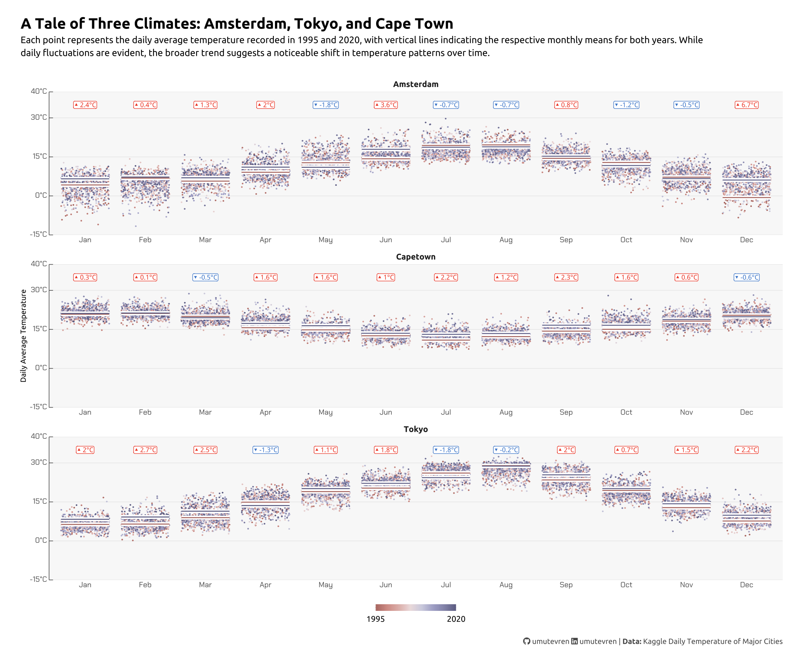

# Temperature Visualization Project

A data visualization project comparing daily temperature patterns across three distinct climates: Amsterdam, Tokyo, and Cape Town, focusing on the years 1995 and 2020 to observe long-term temperature changes.

## Why These Cities?

I chose Amsterdam, Tokyo, and Cape Town because they each represent different parts of the world, with distinct climates and seasonal patterns. Amsterdam has a temperate oceanic climate, Tokyo experiences a humid subtropical one, and Cape Town has a Mediterranean climate. This mix makes it interesting to explore how weather varies across hemispheres and regions. It also offers a broader perspective when comparing global weather trends in a single analysis.

## Data Source

The temperature data is sourced from Kaggle's "Daily Temperature of Major Cities" dataset, which provides comprehensive daily temperature records for cities worldwide.

## Technical Implementation

### Libraries Used
- **tidyverse**: Core data manipulation and visualization
- **ggplot2**: Primary visualization framework
- **ggtext**: Enhanced text rendering with markdown support
- **showtext & sysfonts**: Custom font management
- **MetBrewer**: Color palette implementation
- **scales**: Axis formatting and scaling
- **lubridate**: Date handling
- **janitor**: Data cleaning
- **ggrepel**: Text label positioning
- **ggh4x**: Extended ggplot2 functionality

### Visualization Approach

#### Data Points
- Individual points represent daily average temperatures
- Vertical lines indicate monthly mean temperatures
- Data is faceted by city for clear comparison

#### Visual Elements
- **Color Scheme**: Utilizes MetBrewer's Cassatt1 palette for temporal distinction
- **Temperature Scale**: Y-axis ranges from -15°C to 40°C with Celsius labels
- **Typography**: 
  - Title: Ubuntu font, bold, size 16
  - Subtitle: Ubuntu font, size 10
  - Axis labels: Ubuntu font
  - Data points: Chakra Petch font for numerical values

#### Legend and Annotations
- Color gradient legend indicates year progression (1995-2020)
- Temperature change indicators (▲▼) show direction and magnitude of shifts
- Custom caption with social media links using Font Awesome icons

## File Structure
- `temperature_visualization.R`: Main R script containing the visualization code
- Required font files:
  - Ubuntu (Google Fonts)
  - Chakra Petch (Google Fonts) 